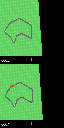
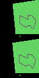

# Multi-Agent Proximal Policy Optimization with TF-Agents






This repository contains a Multi-Agent Proximal Policy Optimization
implementation with TensorFlow-Agents, configured for the 
[`MultiCarRacing-v0` Gym environment](https://github.com/igilitschenski/multi_car_racing).
To use this MARL framework, please see the sections below.

## Installation
To install all the necessary dependencies for this repository, you can do so either 
via `pip` or `conda`:

```
# Clone repo
git clone https://github.com/rmsander/marl_ppo.git
cd marl_ppo/install

# Option A: Install requirements with pip
pip install -r requirements.txt

# Option B: Install requirements with conda
conda env create -f environment.yml
```

## Running the Environment
After installation, the environment can be tried out by running:
```
python3 envs/multi_car_racing.py
```

## Running the Trainer
To run the trainer, please first edit the parameters in `ppo/parameters.py`. 
Then, once ready, run:
```
python3 ppo/ppo_marl.py
```

## Loading Trained Policies
You can find trained policies for (i) Single-agent, (ii) Multi-Agent, and (iii) Self-Play
within the `ppo/ppo_policies` directory. To load these policies for use in evaluation or
pre-training, please see the utility functions and examples in `ppo/load_policies.py.`

**Example**: To load the trained, example `self_play` policy in `ppo/ppo_policies/self_play`,
you can do so by running the following on command-line (from `./`):
```
python3 ppo/load_policies.py -p ppo/ppo_policies/self_play/
```

## Paper and Final Presentation
If you would like to learn more about the theoretical foundations and experiments of this approach, 
please find the paper in this repository under `paper.pdf`.

## Citation
If you find these results or the multi-agent tutorial setup with tf_agents 
useful, please consider citing my paper:
```
@techreport{autonomousauto20,
author = {Sander, Ryan},
year = {2020},
month = {05},
pages = {},
title = {Emergent Autonomous Racing Via Multi-Agent Proximal Policy Optimization}
}
```
If you find the MultiCarRacing-v0 environment useful, please cite our CoRL 
2020 paper: 
```
@inproceedings{SSG2020,
    title={Deep Latent Competition: Learning to Race Using Visual
      Control Policies in Latent Space},
    author={Wilko Schwarting and Tim Seyde and Igor Gilitschenski
      and Lucas Liebenwein and Ryan Sander and Sertac Karaman and Daniela Rus},
    booktitle={Conference on Robot Learning},
    year={2020}
}
```
